# 共享电车站点管理系统 
## 1.1项目总体构成：
 ## 运行登录
- 打开MongoDB
- 运行server.js
- 运行成功后会自动建立所需数据库以及相应数据
- 打开网页输入localhost:3000
- 注册账号
- 用注册的账号登录
- 注意：在有网络且连接数据库的情况下正常运行

 ## 表格介绍
该数据库总共分为3张表格位于myMongoose中
- users:借用信息表
- sts:站点信息表
- login:管理员信息表

 ## 系统介绍
1. 系统界面分为登录页面和超级管理主界面和普通管理界面
2. 管理界面分为站点管理、会员管理、和超级管理
3. 站点管理包括：借用记录，站点信息
4. 会员管理包括：会员基本信息表示例
5. 超级管理包括：权限管理

借用信息，站点信息界面包括增删改查功能，会员管理为示例显示会员列表，权限管理界面包括改查功能（未完成）。

 ## 代码框架
- node.js+mongoose+layui+axios
- layui官方网址：
- https://www.layui.com/doc/
- axios官方网址：
- http://www.axios-js.com/docs/
- 系统github网址
## 1.2引入的包：
-fs 读取文件：读取预先准备好的100个借用记录信息和100个站点信息在首次创建数据库时可以直接读取数据以备创建
-express 根据请求路径来处理客户端发出的GET等各种请求；处理HTTP请求的函数，用来完成各种特定的任务，比如检查用户是否登录、检测用户是否有权限访问等；用来设置参数（渲染模板等）
-insertDB 读取自己编写的请求获取Mongodb数据库服务的程序文件
-cookies 获取cookies服务提取当前登陆用户的登陆信息
-router 获取router服务，用于获取所有路由中的当前登陆用户信息然后提取所需要的状态信息发送到所有网页中以备使用。
## 1.3项目结构
-css 网页中所需要的CSS文件
-data 100个站点信息dataStation.json和100个借用记录信息DataUser.json
-fonts 框架中的字体的字符编码对照文件
-js 网页中所需要调用的.js文件
-lib/layui layui框架中的CSS文件，font文件，iamges文件等
-node_modules node加载模块的缓存
-view 项目中所有的html和ejs文件
-index.html 登陆页面
-MongodbLib.js 调用数据库服务
-server.js nodejs程序主体，运行nodejs进行登陆注册服务，各个路径请求所需的服务，各个页面传回数据接受转发到数据库请求数据库处理的程序都在这里。

## 2 使用说明书：
#### 2.1借用记录界面：

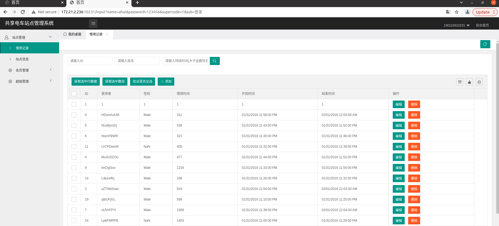

拥有三种筛选条件的查询功能（筛选条件可多选）：

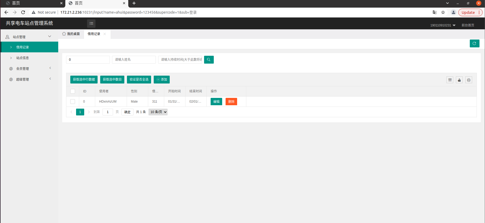

拥有全选键，可以获取选中的数据有多少个，可以点击验证是否全选。

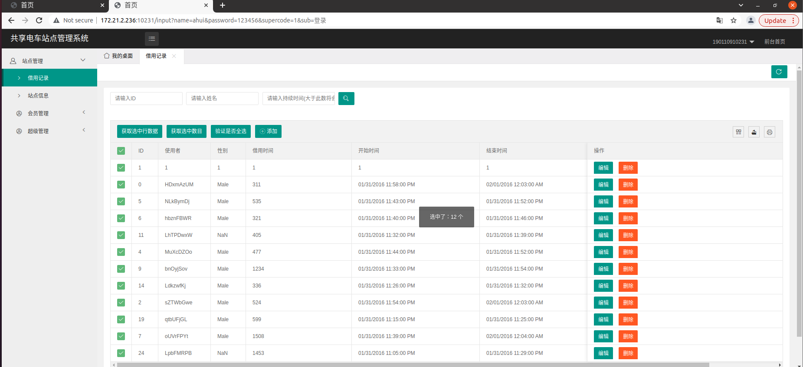

右侧第一个工具按钮可以选择显示想要的信息，第二个可以导出当前数据的csv格式文件，第三个可以打印当前数据

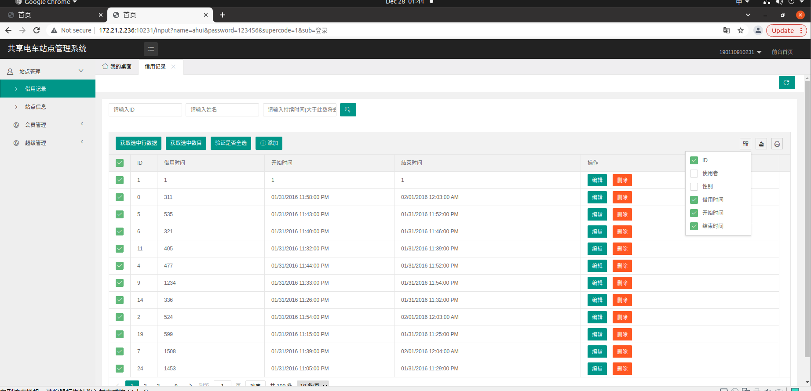

点击编辑按钮会弹出编辑框，编辑该行数据。

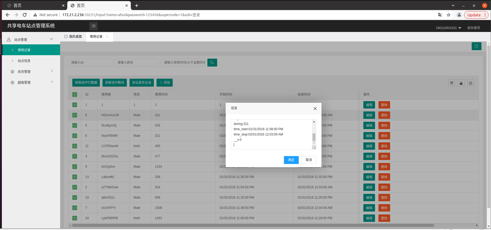

这里我导入的数据模板与数据库的数据词段有差别，编辑导入的数据时候会出现数据错位的情况，但是编辑新添加记录则不会出现此情况。

删除操作，点击删除按钮提示是否删除：

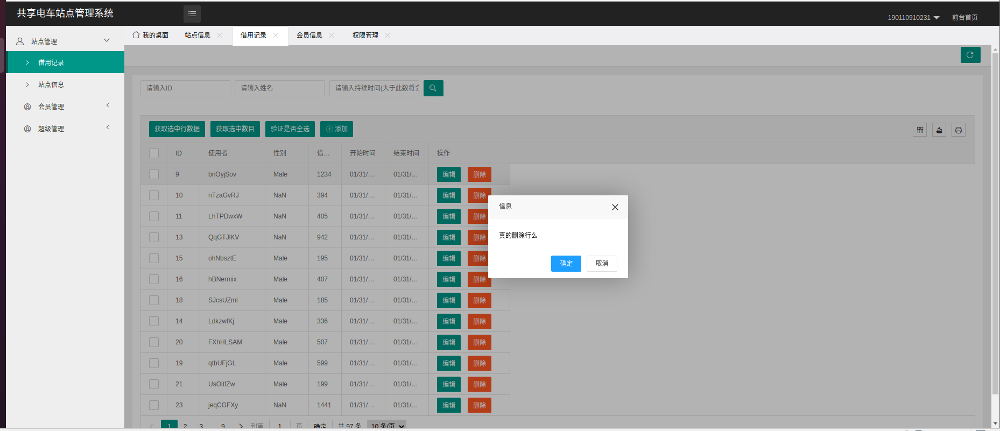

点击确定后完成删除操作：

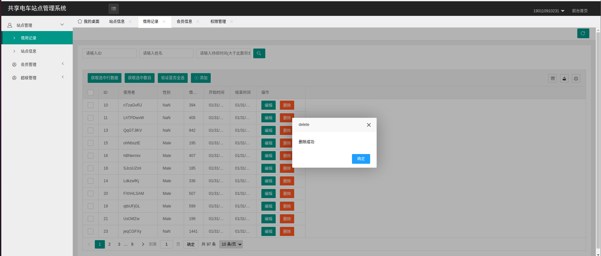

点击添加按钮，弹出添加编辑框进行添加操作：

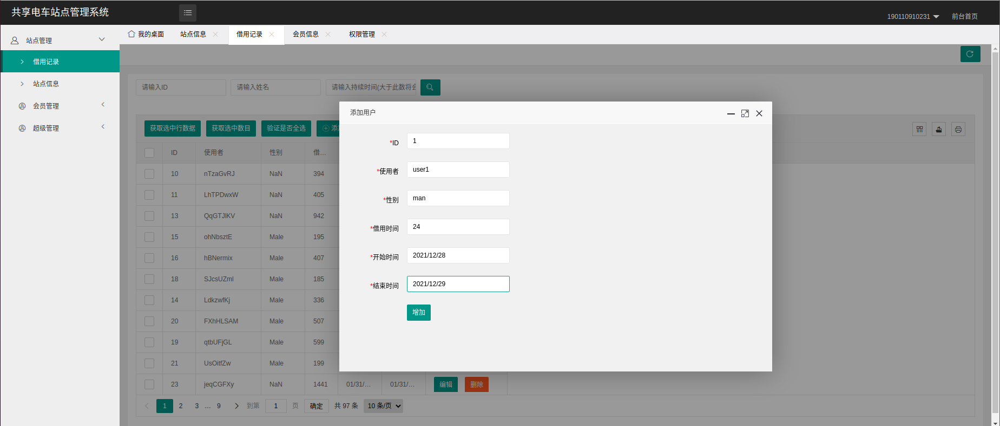

点击添加按钮后添加记录：

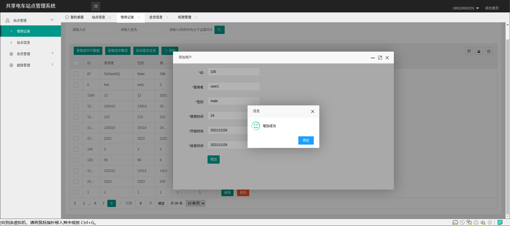

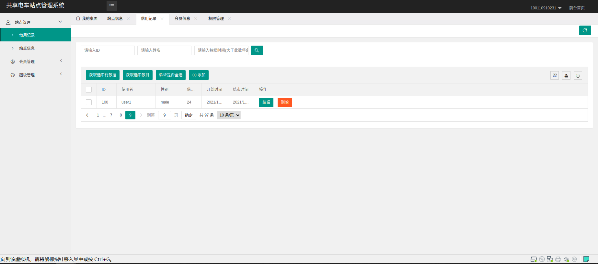

右上角刷新按钮可以刷新页面，同时返回到数据记录的第一页，下方的页数按钮可以点击跳转到所选择页数。

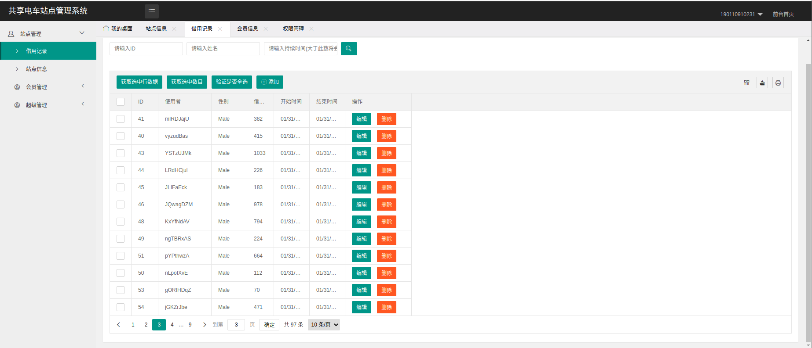

-站点信息界面 操作与借用记录相同不再重复说明

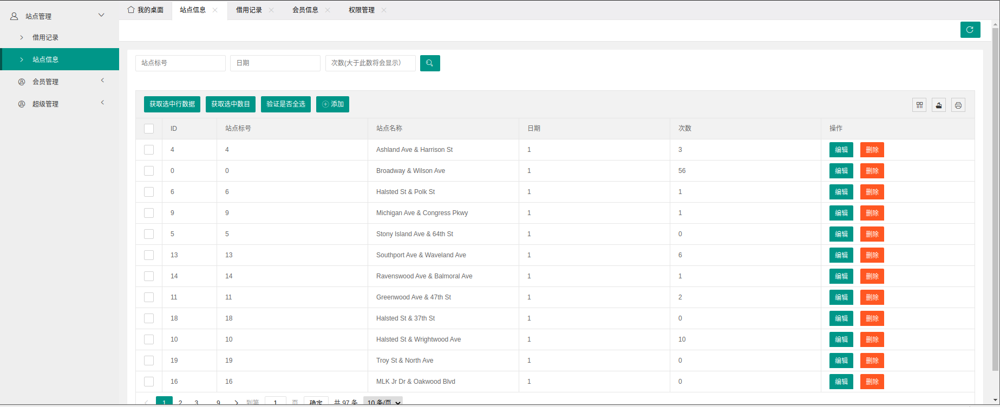

-会员管理界面

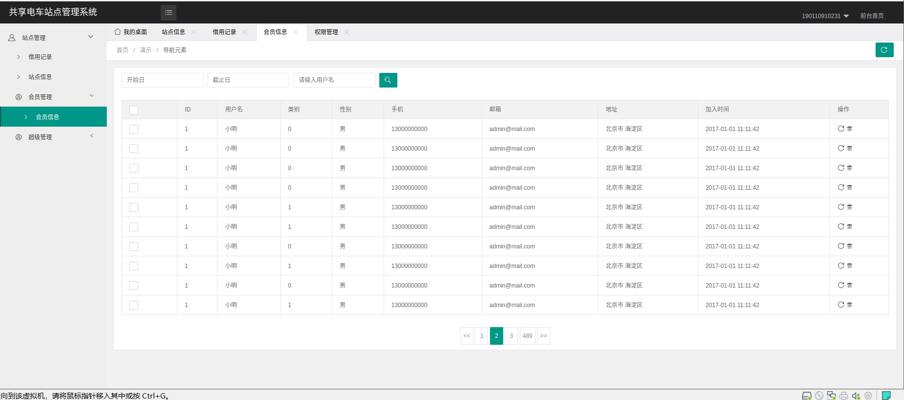

-超级管理界面

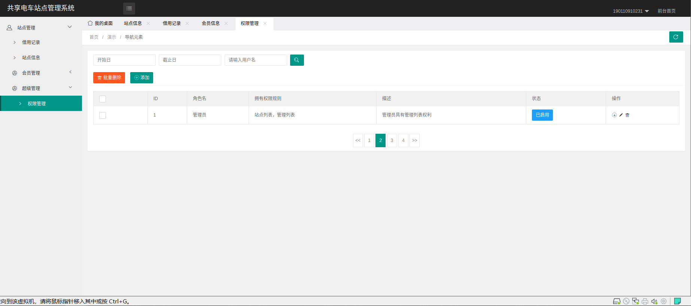

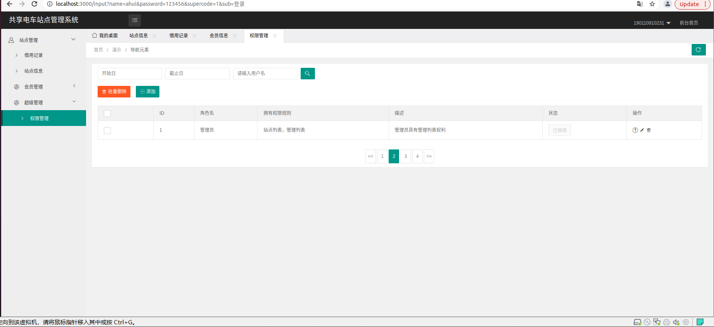

普通管理员登陆后显示的界面：

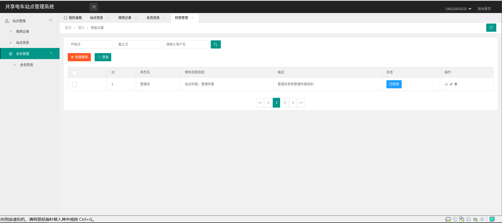

## 开发日记
1.第一版上传至github 从github上寻找到了layui的前端页面框架，但是没有找到对应的nodejs接口，后面的nodejs接口都得自己慢慢写慢慢改，由于我之前一点nodejs都没学过，遇到了一堆bug以及前后端接收信息不对称问题，第一版版还是有很多问题没有解决。
2.第二版 修改增加数据操作结束后一直提示添加错误的问题（实际添加成功也会出现），更正了修改数据操作后数据错位的问题
3.第三版 区分超级用户与普通用户研究了好久弄不好  有通过router方法获得用户权限信息然后传给某一个方法例如删除表格数据方法中从而实现用户删不掉而管理员删得掉 但是程序一直反复报错，
有试验用cookie记录用户登陆信息然后再传给方法实现上面的效果也是一直显示传输的数据未定义 最后实现的是通过router记录用户权限信息，然后通过res.render将登陆信息发送到所有路径的网页文件中，在demo.ejs主页上设置超级管理员显示有管理页面和站点管理页，而管理员只有站点管理页面。 另外添加了站点信息界面的删除功能。
4.第四版 增加了站点信息界面的增改查功能，修复了站点信息界面和借用信息界面查询栏的第二格所输入的条件无法进入后台的问题
5.第五版 将账号信息转移到与站点等信息同一个数据库内，编写权限管理页面的nodejs方法放入路由，将数据导入权限管理页面使得能够显示所有账号信息。修复了账号密码输入错误时候导致程序崩溃的问题。
6.第六版 重启后发现前面设置超级管理员和普通管理员的分别有问题，demo.ejs识别不到后台router传送的数据，在修改的过程还出现了demo.ejs中一段注释没有删掉导致网站一直崩溃的问题，这个问题一直没有发现然后我以为是render的问题一直在调试render，调试了一天到晚上12点半才发现是注释的问题....... 后续删除了router，改用在登陆的时候使用res.render将一个“超管码”传输到demo.ejs，然后编写脚本判断是否是超级管理员或者普通管理员，以显示不同的左边栏。
7.第七版 整理代码 在制作权限管理功能时候出现了一个bug，我想要列出所有的管理员信息，但是显示不了，原本以为是前端与后端接口的变量名不匹配导致的通过F12排查前端页面数据过后发现不是，又去检查后端接口代码发现并没有从数据库中读取到数据，从第一个数据开始就没有读取到文件，又去排查数据库内数据发现并没有问题，使用console.log输出docs，err，传输到前端的数据全部是空值，更改find函数查找的字段，手动给数据库数据添加字段都没效果，全部输出的是空值而且没有报错，百度，询问同学，询问学长都没用，最后由于时间问题 就提交了。

8.第八版 完成readme.md 